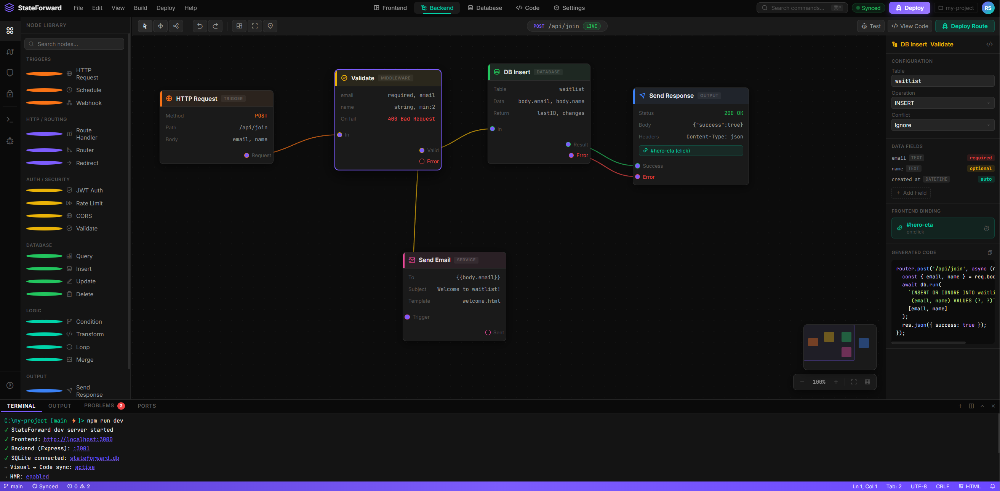

# StateForward

> **Design your system visually. Get real, production-grade code.**

---

Programming has always moved toward higher levels of abstraction. We started with binary. Then assembly. Then high-level languages. Every step removed complexity and let developers focus more on solving problems than writing instructions.

I believe the next step is moving beyond writing code altogether. The goal isn't to replace code—it is to replace the need to manually produce it.

Instead of writing thousands of lines, developers design systems. They connect architecture, define data flow, business logic, and interactions through visual C4-inspired node graphs. AI translates that architecture into production-ready code using proven libraries, frameworks, and patterns.

> ### 💡 Code becomes the implementation, not the interface.
> The node graph is the source of intent. AI handles the repetitive implementation while developers stay focused on system design, architecture, and product thinking.

This is the direction Snap is built toward—not another low-code platform, but a development environment where architecture becomes the programming language:

*   **🎨 Visual Builder** — Drag-and-drop frontend + node-based backend canvas. Every node is real code.
*   **💻 Code Editor** — True two-way sync. Change the canvas → code updates. Change the code → canvas updates.
*   **🔌 Frontend ↔ Backend Binding** — Wire UI components directly to backend nodes. No mental mapping.

---

### ⚙️ Core Philosophy

*   **No Lock-in:** The output is plain, portable JavaScript. Remove StateForward and the codebase stays intact.
*   **Desktop Native:** Built as an **Electron desktop app** — real filesystem access, real codebases, not a sandbox.

---

## C4 Architecture Canvas

StateForward's canvas is heavily inspired by [IcePanel](https://icepanel.io) and the [C4 model](https://c4model.com) — a way of visualizing software architecture at multiple zoom levels. The key difference: in IcePanel, diagrams are documentation. In StateForward, they generate and stay in sync with real code.

**The canvas operates at 4 levels:**

| Level | What you see | Maps to |
|---|---|---|
| System | Your entire product — services, databases, external APIs | Top-level architecture |
| Container | Inside a service — the apps, queues, caches that make it up | Infrastructure / deployment units |
| Component | Inside a container — route handlers, controllers, queries | Real code modules |
| Code | Inside a component — the actual function or class | Live Monaco editor |

Clicking any node **drills down** to the next level. The back button **zooms out**. You're always navigating the same canvas — just at different granularities.

**Canvas features (planned):**
- Animated data-flow arrows showing how requests and data move between nodes
- Color-coded node types: frontend components, API routes, DB queries, auth, external services
- Grouped zones (e.g. "Backend cluster", "Frontend app") with collapsible boundaries
- Node status indicators — live, draft, broken connection
- Pan, zoom, minimap for large systems
- Click any node at Component level → opens the corresponding file in Monaco

This is the core visual experience. Everything else — code generation, AI, two-way sync — builds on top of this canvas.

---

## Node-First Development

The long-term vision: you work entirely at the node level. Add a node, connect it, configure it — the system writes the code. Delete a node — the code is removed. No boilerplate, no context switching. You operate at the architecture layer; the code layer takes care of itself.

---

## AI Integration

AI wired into the canvas like [Onlook](https://github.com/onlook-dev/onlook) — not a generic sidebar. The IDE already knows your component tree, node graph, and data flows, so AI can act meaningfully: generate a node from a description, wire a component to a backend, refactor across both layers at once.

Bring your own API key — no vendor lock-in:

**Paid:** OpenAI · Anthropic  
**Free:** [Google AI Studio](https://aistudio.google.com) · [Groq](https://console.groq.com) · [NVIDIA NIM](https://build.nvidia.com) · [Cerebras](https://cloud.cerebras.ai) · [DeepSeek](https://platform.deepseek.com) · [Mistral](https://console.mistral.ai) · [OpenRouter](https://openrouter.ai)  
**Local:** [Ollama](https://ollama.com) — fully offline, no external calls

---

## Key Open Source Building Blocks

[React Flow](https://github.com/xyflow/xyflow) (canvas) · [Monaco Editor](https://github.com/microsoft/monaco-editor) (code editor) · [GrapesJS](https://github.com/GrapesJS/grapesjs) or [Puck](https://github.com/puckeditor/puck) (frontend builder) · [Onlook](https://github.com/onlook-dev/onlook) (two-way sync reference) · [Sandpack](https://github.com/codesandbox/sandpack) (live preview) · [Appsmith](https://github.com/appsmithorg/appsmith) (UI-backend binding reference)

---

## Current State & Visualizations

**This is a UI prototype — an idea preview, not a working product.**

A static mockup (`index.html` + `styles.css` + `app.js`) showing what the IDE could look like. No working canvas, no code generation, no sync engine. I built it to communicate the vision, but don't have the skills to take it further alone.

**Start here:** `doc_dump/snap-design-doc.md` has the full architecture thinking.

> ⚠️ **These are NOT the final project.** The screenshots below are early, rough mockups — a dumb visualisation built to imagine and communicate what the actual product *might* look like. The real implementation may look completely different.

### 🎨 Frontend Builder

### 🔀 Backend Node Canvas

### 💻 Code Editor

### 🗄️ Database Viewer

---

## Contributing

See [CONTRIBUTING.md](./CONTRIBUTING.md).

## License

[MIT](./LICENSE)
