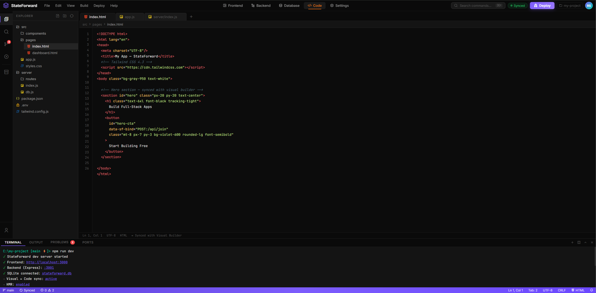

<div align="center">


# StateForward

**Architecture-first development environment where system design becomes executable code.**


---

</div>

## The Problem

<table>
<tr>
<td width="50%">

We already design systems before we build them.

We draw **C4 diagrams**. We define **services**, **APIs**, **databases**, **events**, and how everything connects. We present these in design reviews, store them in wikis, reference them during onboarding.

</td>
<td width="50%">

### Then we throw them away.

Once design ends, we open a code editor and **manually recreate** the same architecture through thousands of lines of implementation.

The diagram becomes outdated the moment development begins.

</td>
</tr>
</table>

<div align="center">

### This feels backwards.

**Why manually translate architecture into code when the architecture already describes what we want?**

</div>

<br/>

## The Vision

<div align="center">

### The Next Level of Abstraction

Programming has always moved one level higher.

**Binary** → **Assembly** → **High-Level Languages** → **Architecture?**

</div>

We started with binary. Then assembly. Then high-level languages. Every step removed a layer of manual work and let us focus more on solving problems than telling the computer exactly what to do.

**I believe the next step is moving beyond writing most of the code ourselves.**

Not because code disappears code is still what runs everything. But writing thousands of lines of implementation shouldn't be where developers spend most of their time.

---

### Architecture as Source of Truth

<table>
<tr>
<td width="60%">

StateForward explores a different approach: **the architecture model becomes the project itself.**

The development environment is built around a C4-inspired, multi-layer architecture model influenced by tools like [IcePanel](https://icepanel.io). Systems, containers, components, APIs, databases, queues, and their relationships aren't just visual diagrams—they directly describe how the application works.

**The visual model isn't documentation. It's the project itself.**

</td>
<td width="40%">

```
┌──────────────────────────┐
│                          │
│  Developer designs       │
│  architecture            │
│         ↓                │
│  AI generates            │
│  production code         │
│         ↓                │
│  Code remains readable,  │
│  editable, portable      │
│                          │
└──────────────────────────┘
```

</td>
</tr>
</table>

AI doesn't decide the architecture. **That's still the developer's job.**

The developer designs the system. AI turns that design into production code using existing frameworks, libraries, and proven patterns. The generated code stays readable, editable, and completely portable. If you want to work directly in code, you can. The visual model and the code are simply two representations of the same system.

> **This isn't no-code. This is architecture-as-code.**

You still control the system design. You still decide the architecture. You still write custom logic when needed. But you spend less time writing implementation and more time designing systems.

---

### The Direction Forward

<div align="center">

I don't think the future is no-code.

**I think the future is where developers spend less time writing implementation and more time designing systems.**

</div>

StateForward is an exploration of that future where architecture diagrams aren't just documentation, but the primary interface for building software. Where the complexity of implementation is handled by AI trained on proven patterns, and developers focus on what matters: designing robust, scalable systems.

<br/>

## How It Works

We are heavily inspired by the C4 diagram workflow, but rigid diagrams fail in the real world. Real-world code is too chaotic, custom, and complex to be boxed into static boxes. Instead of locking developers into a visual cage, we are building a system with multi-layer scalability. This safely describes system architecture while retaining precise, granular control over individual components, simplifying them without stripping away their power.

We aren't here to write thousands of lines of unnecessary code or invent new compiler tech from scratch. The building blocks—mature frameworks, battle-tested libraries, and robust components—already exist. The magic isn't in building new wheels; it's in the vision of how we connect them.

---

## Core Features

<table>
<tr>
<td width="33%" valign="top">

### Visual Builder

**Frontend:** Webflow-style drag-and-drop page builder  
**Backend:** Node-based canvas where every node is real code

</td>
<td width="33%" valign="top">

### Two-Way Sync

**Change the canvas** → code updates  
**Change the code** → canvas updates  

Neither is the source of truth. Both are synchronized views.

</td>
<td width="33%" valign="top">

### Direct Bindings

Wire UI components directly to backend nodes.  

No implicit mental mapping between frontend and backend logic.

</td>
</tr>
</table>

### Frontend ↔ Backend Connection System

Frontend components and backend nodes connect through an **explicit tagging and binding system**.

- Tag a button in the frontend builder
- Bind it to an API route node in the backend canvas
- The connection is inspectable, traceable, and reflected in generated code

**This replaces the implicit mental model developers normally maintain.**

<br/>

---

I built this prototype to communicate the vision, but I don't have the skills to build the real product alone. This is an open invitation for developers, designers, and architects who find this idea compelling to collaborate and make it real.

<details>
<summary><b>View Visual Mockups</b></summary>

<br/>

> **Note:** These are early mockups showing what the IDE _might_ look like. The final implementation will evolve based on technical requirements and user feedback.

### Frontend Builder

_Webflow-style drag-and-drop interface for visual frontend construction_

### Backend Node Canvas

_Node-based backend architecture canvas with data flow visualization_

### Code Editor

_Integrated Monaco editor with synchronized visual-to-code updates_

### Database Viewer

_Visual database schema management and query builder_

</details>

<br/>

## Learn More

- **[C4 Model](https://c4model.com/)** — The architecture visualization framework StateForward is built on
- **[IcePanel](https://icepanel.io)** — The tool that inspired the visual approach (but makes diagrams, not code)
- **[Spec-Driven Development](https://medium.com/@enrico.papalini/the-evolution-of-spec-driven-development-c3b5efebb69a)** — Related philosophy about treating specs as source of truth
- **[The Future of Coding](https://github.com/rrb-rushikesh/StateForward/blob/main/docs/vision.md)** _(coming soon)_ — Deeper exploration of architecture-first development

<br/>

---


<div align="center">

**Built with the belief that the future of coding is designing systems, not writing implementation.**


</div>
