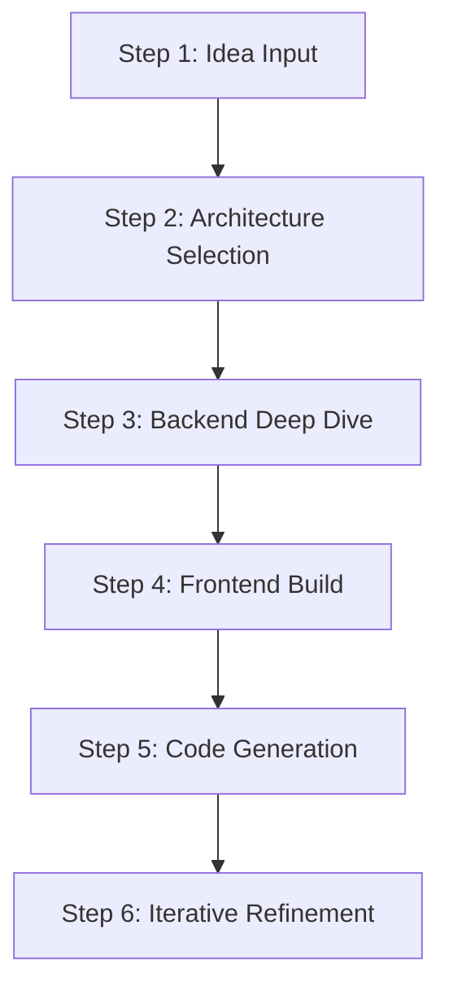

<div align="center">


# StateForward

**Architecture-first development environment where system design becomes executable code.**

[Vision](#the-vision) · [The Layout](#the-layout) · [How It Works](#how-it-works) · [The Engine](#the-engine) · [Current State](#current-state)

---

</div>

## The Problem: Why AI Coding Tools Fail

Every AI-driven developer tool today (Cursor, Copilot, Devin) relies on raw natural language prompting. But natural language is inherently ambiguous. "Build a secure login system" can mean a hundred different things. The result is a frustrating, repetitive loop: *prompt, generate, hallucinate, debug, and repeat*. It does not scale for complex, production-grade systems.

At the same time, we already design systems at a high level before we build them. We draw **C4 diagrams**, define **services**, **APIs**, **databases**, **queues**, and how data flows between them. But once design ends, we open a code editor and **manually recreate** that architecture through thousands of lines of boilerplate code. The diagrams are thrown away and become outdated immediately.

**Why manually translate architecture into code when the architecture itself could describe what we want?**

---

## The Vision: Architecture as the Source of Truth

StateForward shifts the focus of software engineering from writing lines of code and repetitive prompting to designing system architecture. 

In this paradigm, **the architecture model is the source of truth**, and the code is simply a rendering of it. 

* **Natural language** handles the *why* (goals and constraints).
* **The architecture** handles the *what* (systems, containers, components, contracts).
* **The compilation engine** handles the *how* (generating precise, readable code).

This separation of concerns delivers deterministic, hallucination-free production code.

> **This isn't no-code. This is architecture-as-code.**  
> You retain complete control over the system design and can write custom logic when needed. But you spend less time writing implementation and more time designing robust, scalable systems.

---

## The Layout

The IDE is designed around three permanent zones that are always visible:

1. **The Frontend Tab (Visual Canvas + Component Tree + Inline Editing)**
   * Think Claude Code meets Onlook. You build UI components visually, and the code mirrors it in real time. 
2. **The Backend Tab (C4-Style Layered Architecture)**
   * A node-based canvas mapping systems, containers, components, and connections. You visually define services, databases, queues, and API routes.
3. **The Chat Tab (Docked Reasoning Layer)**
   * Not a standard chatbot, but an active reasoning partner. It explains tradeoffs, challenges questionable design choices, answers what-if questions, and recalculates the structural impact of every change you make.

### Why Separate Tabs?
Frontend and backend have fundamentally different abstraction models. Frontend focuses on visual hierarchy, state, components, and styling. Backend focuses on layers, services, data flow, and deployment. The C4 model maps perfectly to backend design, while frontend needs a layout-driven paradigm. The connection between them—routes, API contracts, and data shapes—is validated continuously by the AI engine.

---

## How It Works



### Step 1 — Idea Input
You describe the system in natural language (e.g., *"Build a train booking system. Users search trains, book seats, pay online."*). 
The AI evaluates the request, highlights unrealistic constraints (e.g., real-time seat locking at 10K req/s with a basic monolith), and presents 2-3 battle-tested architecture options with their tradeoffs.

### Step 2 — Architecture Selection
You select the architecture option that fits your constraints. The backend tab automatically populates with a **C4 Level 1 diagram** showing top-level systems, actors (users/admins), and external dependencies (payment gateways, SMS notification systems).

### Step 3 — Backend Deep Dive
You zoom into **Level 2 (Containers)** to configure database schemas, API servers, cache layers, and queues. You can drill down to **Level 3 (Components)** to structure controllers, repositories, and middleware. Every time you rename services or draw new connections, data flows and API contracts update automatically.

### Step 4 — Frontend Build
Switch to the frontend tab. Based on your backend API endpoints, the system auto-generates a starting component tree (pages, layouts, hooks). Using a binding panel, you can connect any frontend component directly to a backend API route. The client code is auto-generated to match the backend contract exactly.

### Step 5 — Code Generation
Hit generate. The compilation engine walks the C4 graph. It translates app nodes to modular services with routes and middleware, store nodes to schemas and migrations, and connection edges to API clients or event subscriptions. 
The output is a complete, runnable project: source code, tests, docker-compose files, environment configurations, and CI pipelines.

### Step 6 — Iteration
Modify the architecture canvas at any time. The engine recalculates the changes and regenerates only the affected code blocks. A visual diff highlights what changed in the architecture, while a code diff shows the generated delta.

---

## The Engine (Compiler Pipeline)

The code generation system is not a simple LLM wrapper that writes code from scratch. It is a structured compiler pipeline:

```
┌────────────────────────┐      ┌────────────────────────┐      ┌────────────────────────┐
│      C4 Graph &        │ ───> │ Architecture           │ ───> │ Template Resolver      │
│     Visual Canvas      │      │ Interpreter            │      │ (Maps to Boilerplates) │
└────────────────────────┘      └────────────────────────┘      └────────────────────────┘
                                                                            │
                                                                            ▼
┌────────────────────────┐      ┌────────────────────────┐      ┌────────────────────────┐
│ Runnable Production    │ <─── │ Constrained AI         │ <─── │ Code Generator         │
│ Code Output            │      │ Reasoning Layer        │      │ (Assembles Files)      │
└────────────────────────┘      └────────────────────────┘      └────────────────────────┘
```

1. **Architecture Interpreter:** Reads the visual C4 graph and validates structural consistency, checking API paths, database queries, and service connections.
2. **Template Resolver:** Matches node types to production-ready, battle-tested code templates for the target stack.
3. **Code Generator:** Produces standard files, setup wiring, and project directory structures.
4. **Constrained AI Reasoning Layer:** Sits on top of the templates to fill in custom business logic and refine implementation, minimizing hallucinations by operating within strict architectural boundaries.

---

## How Is This Different?

| Tool | Purpose | Output | Abstraction Level |
| :--- | :--- | :--- | :--- |
| **IcePanel** | C4 architecture diagrams for documentation | Static diagrams in wikis | Documentation |
| **Webflow** | Visual website builder | HTML/CSS/JS (frontend only) | UI Layout |
| **Retool** | Internal tool builder | Hosted, locked-in dashboards | Low-Code UI |
| **GitHub Copilot** | AI code completion | Inline code suggestions | Code Editor |
| **StateForward** | Architecture as executable source code | **Full-stack code generated from C4 models** | System Architecture |

---

## Current State

### Core Compiler Engine Prototype
The core compiler engine (StateForward) has been built and validates the compiler pipeline. It successfully demonstrates reading structured system specifications, resolving templates, and producing clean code.

* **What is built:**
  * **Core Compiler Engine:** Working compiler skeleton that interprets architectural nodes and handles structural code generation.
  * **Visual Design Mockups:** Detailed layouts for the frontend canvas, C4 backend canvas, and code editor synchronization.
* **What is in active development:**
  * **Interactive Canvas:** Direct React Flow integration for editing nodes visually.
  * **Two-Way Sync:** Bi-directional syncing mapping visual changes directly to AST and code changes.
  * **Desktop Shell:** Electron packaging for local-first filesystem access.

> [!IMPORTANT]
> **Proprietary & Private Codebase**  
> The core compiler engine implementation and underlying code generation mechanics are highly proprietary. The repository is kept private to protect this intellectual property. Access is restricted and provided on an invitation-only basis for co-founder discussions and technical evaluations.

<details>
<summary><b>View Visual Mockups</b></summary>

<br/>

> **Note:** These are early mockups showing what the IDE _might_ look like. The final implementation will evolve based on technical requirements and user feedback.

### Frontend Builder

*Webflow-style drag-and-drop interface for visual frontend construction*

### Backend Node Canvas

*Node-based backend architecture canvas with data flow visualization*

### Code Editor

*Integrated Monaco editor with synchronized visual-to-code updates*

### Database Viewer

*Visual database schema management and query builder*

</details>

---

## Target Tech Stack

The IDE is built to run locally as a native desktop application using:

```
Electron + React + Vite
├── React Flow (node-based backend canvas)
├── Monaco Editor (integrated code editor)
├── Fabric.js / Lexical (frontend visual builder)
└── LLM Core + AST Compilers (architecture → code translation)
```

---

## Learn More

* **[C4 Model](https://c4model.com/)** — The architecture visualization framework StateForward is built on.
* **[IcePanel](https://icepanel.io)** — The tool that inspired our visual backend approach.
* **[Spec-Driven Development](https://medium.com/@enrico.papalini/the-evolution-of-spec-driven-development-c3b5efebb69a)** — General philosophy about treating specifications as the source of truth.

---

<div align="center">

**Built with the belief that the future of coding is designing systems, not writing implementation.**

</div>
